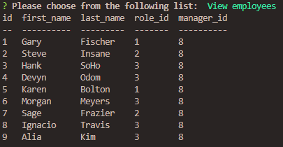
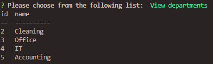
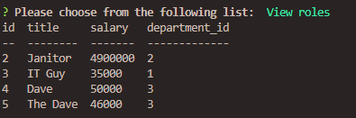

# employ-traq
  

This is a CLI*¹ application to enable a user to view and manage the employees, roles, and departments of a givin company. The database is built utilizing *MySQL* and lets the user ***C**reate*, ***R**ead*, ***U**pdate*, and ***D**elete* data from the database. Otherwise known as ***CRUD***.
 
 

## Employee Database Tracker
***
 

Here we will cover the programs functionality. Lets begin with employee information. Below is a screenshot of the employee data table. ↓
 

 
 

Next we have the department table. ↓
 

 
 

And lastly we have the roles with in the company. ↓
 

 
 

All of the data in these tables may be viewed, updated, created or deleted. And a short video showing the application in use is at the following link: 
## Dependencies 

* Node.js
* Inquirer
* MySQL2

#### Footnotes
***
 

*¹ *Command Line Interface* 